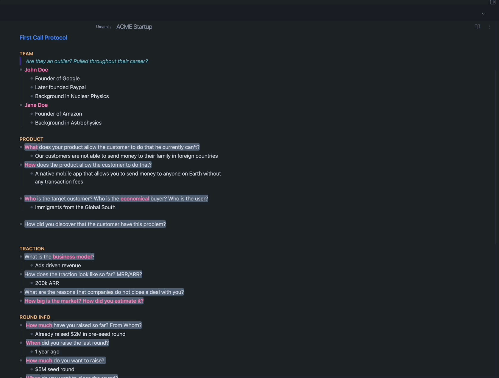

# Description
This is an obsidian plugin that reads notes from a VC (either covering a startup or information about a fellow VC) and summarizes it in a structured way using the power of GPT-3. If the VC is using Affinity as their CRM, they can also push the summary directly to Affinity to make sure their notes are always in sync. The workflow section explains in more details how this works. 

**New**: You can now highlight any sentence in your database -> Cmd + P -> Find Similar Ideas -> and you will get all similar ideas from all your notes on sentence/paragraph level!

# GIF Demo

# Setup Steps
- Clone this repo into `<obsidian-vault-path>/.obsidian/plugins/vc_wizard/`
## Creating Python Virtual Environment
I will use conda here. Follow the following steps in the terminal (first cd to the VC Wizard plugin folder)
- `conda env create -f ./environment.yml`
- `conda activate <env-name>``
- `which python` -> copy the path and paste it into the correct setting of the plugin
- To use the idea similarity function, you need the AdvancedURI Plugin installed
## Settings
- The Affinity settings are only needed if you are using Affinity as CRM and would like to automatically push startups there. If you are just using it for summarization and cleaning it from markdown syntax, just fill the other settings
- Do not forget to have a '/' at the end of the vault path (otherwise it won't work)

# Workflow
## Summarization and Affinity Sync
- After the call, add the correct hashtags to the note
	- For a VC -> #network/connected  and type of VC ( #Person/VC or #Entity/VC )
	- For startup -> #startups/screened 
- To summarize:
	- For a startup -> use the mouse to highlight the text you want to summarize -> `Cmd + P` -> summarize this startup
	- For a VC -> `Cmd + P` -> Summarize All VC Notes
- Check the #review and #review_startup hashtags
- Approve that everything is fine or make your changes to the summary
- Remove the #review (or #review_startup ) hashtag and add ( #Affinity ) instead
- `Cmd + P` -> Push VCs or Startups to Affinity
- Voila, data is pushed to Affinity ( the affinity hashtag will be removed automatically)

## Connected Ideas
- You have to first index your database, this can be achieved through "Index Vault" Command from the command pallete
- Afterwards, everytime you change anything in your vault this would be recorded but won't be indexed till you run the command "Reindex New/Changed Files only"
- You can then highlight any sentence or paragraph you like from your knowledge base -> run the comman "Find Similar Ideas" and enjoy the new connections in your second brain!

# Tips & Tricks
- After creating the summary, a header called (# Stop Indexing) is automatically added. This stops the code from reading further. If you wish to include more of your detailed notes into the note that gets pushed to affinity, simply add them before the (# Stop Indexing) header.

